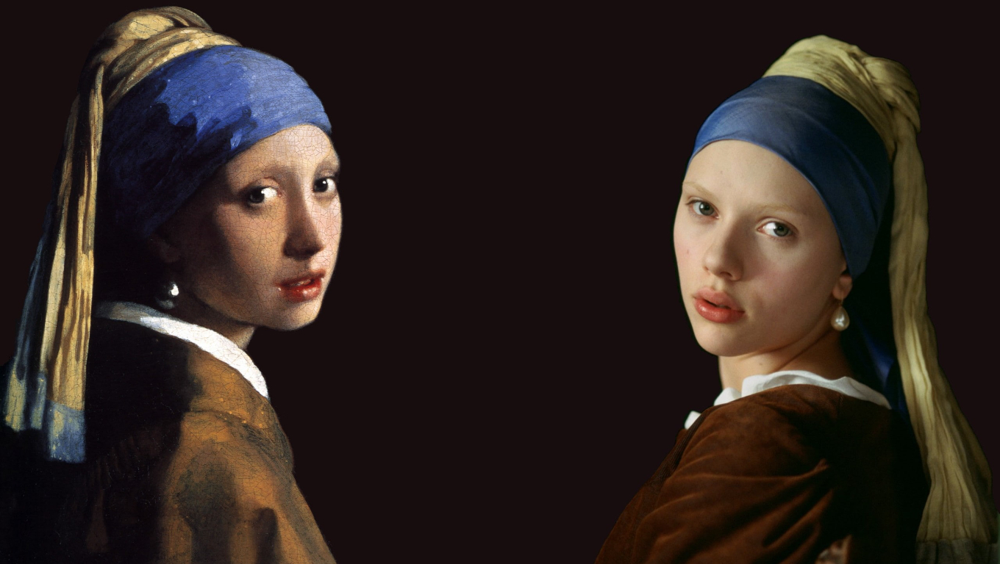

# Hi, I'm Rambuda Ondwela! :wave:

I am a multi-talented individual with a passion for **technology**, **sports**, **fashion**, **video games**, **memes**, and the **arts**. I specialize in programming languages such as  `Python`, `Java`, a little bit of `C++`,`HTML`, `CSS`, and `JavaScript`, and I enjoy creating software solutions for real-world problems. I also have experience working with `Linux` and open-source technologies.

When I'm not coding, I can often be found playing video games, browsing memes, or staying up to date with the latest fashion trends. I have a keen interest in pop culture and believe that it's important to stay connected with what's happening in the world.

In addition to my technical skills and interests, I also have a creative side. I enjoy making art and producing music in my free time. I find that creating art and music allows me to express myself in ways that are not always possible through code.

Overall, I am a well-rounded individual with a diverse set of skills and interests. Whether it's writing code, playing video games, or creating art, I'm always eager to learn and explore new things. Feel free to check out my [GitHub profile](https://github.com/worldwidewurf) to see some of my coding projects and get in touch if you want to collaborate on something cool!

<!---
worldwidewurf/worldwidewurf is a ✨ special ✨ repository because its `README.md` (this file) appears on your GitHub profile.
You can click the Preview link to take a look at your changes.
--->
